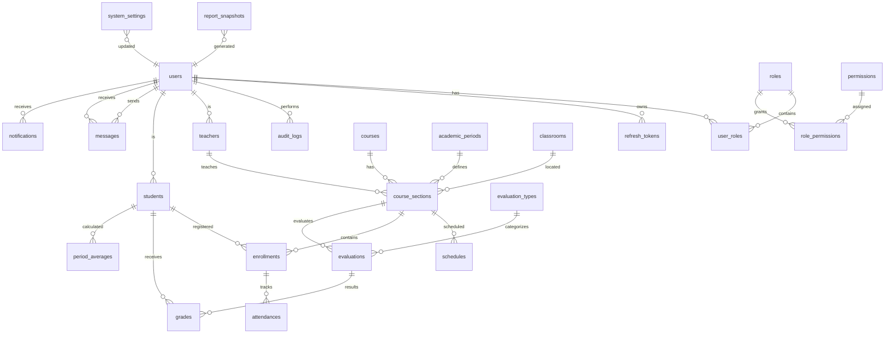

# Diagrama Entidad-Relación — Academic SaaS

## Convenciones

- **PK**: UUID en todas las tablas (columna `id`)
- **Timestamps**: `created_at`, `updated_at` en todas las tablas
- **Soft-delete**: `deleted_at` en `users`, `courses`, `students`
- **FKs**: `ON DELETE RESTRICT` por defecto, `CASCADE` solo en composición real
- **Nombres**: snake_case, plural

## Excepciones a 3FN

- `period_averages`: tabla derivada (cache) para performance de dashboard. Se recalcula periódicamente vía evento de dominio o tarea programada. Documentado en ADR-003.
